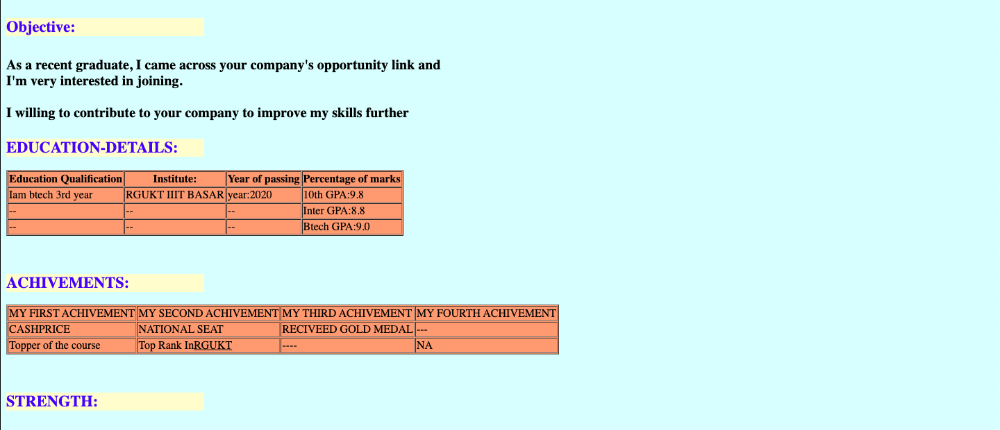

# 💼 First HTML Resume Website

This is a simple HTML-based personal resume website. It's perfect for showcasing your skills, education, experience, and projects in a clean, professional format.

## ✨ Features

- Responsive single-page layout
- Clean and minimal design
- Easy to customize HTML and CSS
- Sections: About Me, Education, Skills, Projects, Contact

## 🛠️ Tech Stack

- HTML
- CSS
- (Optional) JavaScript

## 📸 Screenshot

🌐 Demo
If deployed on GitHub Pages, access the live version here:
Live Demo : https://srujanachalluri.github.io/First_HTML_Resume/

📬 Contact
If you'd like to connect:

LinkedIn: https://www.linkedin.com/in/srujana-challuri-b63b18160
